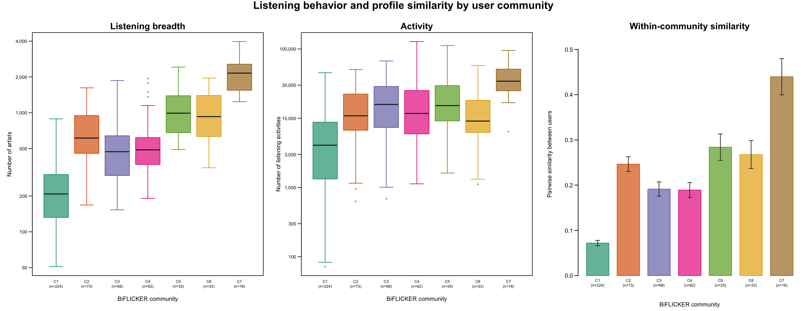
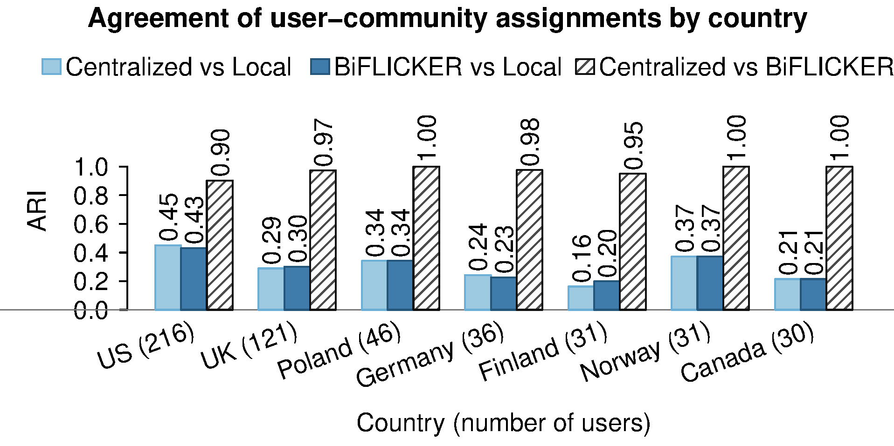

# Last.fm 1K: Federated Community Detection in a Bipartite Network

This repository contains the complete Last.fm 1K application for federated
community detection in a user–artist bipartite network. It includes the final
preprocessing workflow, country-level data splits, local and centralized
spectral benchmarks, the Sequential BiFLICKER analysis, comparison figures, and
user-community interpretation.

The analyzed adjacency matrix is binary: an edge indicates that a user listened
to an artist at least once. The edge list also retains the number of listening
events for descriptive analyses of activity. Raw Last.fm files are not included.
Processed row-level networks, user assignments, and singular-vector embeddings
are also not redistributed; the scripts regenerate them locally.

## Repository structure

```text
.
├── README.md
├── scripts/
│   ├── 01_prepare_lastfm1k.py
│   ├── 02_spectral_community_analysis.R
│   ├── 03_country_label_ari_figure.R
│   └── 04_user_community_interpretation.R
├── preparation/
│   ├── data/                      generated locally; not tracked
│   ├── figures/
│   └── summary/
└── results/
    ├── local/
    ├── central/
    ├── biflicker/
    ├── comparisons/
    └── interpretation/
```

### `scripts/`

The scripts form one sequential workflow:

1. `01_prepare_lastfm1k.py` streams the raw files, applies all filters, writes
   the cleaned network and metadata, and generates preparation diagnostics.
2. `02_spectral_community_analysis.R` creates country splits and runs local
   SVD/community detection, centralized SVD/community detection, and Sequential
   BiFLICKER.
3. `03_country_label_ari_figure.R` compares local, centralized, and Sequential
   BiFLICKER assignments by country using the adjusted Rand index (ARI).
4. `04_user_community_interpretation.R` produces the demographic table, the
   three-panel listening-behavior figure, representative-artist statistics,
   and community-level genre interpretations.

### `preparation/`

- `data/` is generated locally and ignored by Git. It contains retained user
  and artist metadata, the weighted edge list, the cleaned binary Matrix Market
  file, and country/server splits.
- `summary/data_summary.json`: filtering parameters, checksums, sample sizes,
  missingness, country and network summaries, and filter history.
- `summary/singular_values.csv`: leading singular values of the cleaned network.
- `figures/`: degree histograms and singular-value elbow plots (PDF and PNG).

### `results/`

- `local/`: aggregate local singular-value diagnostics for each country server.
- `central/`: centralized singular-value diagnostics.
- `biflicker/`: Sequential BiFLICKER singular-value and convergence diagnostics
  and run settings.
- `comparisons/`: country-level ARI values and grouped comparison figure.
- `interpretation/`: community demographics; breadth, activity, and pairwise
  binary-cosine similarity; representative artists and coverage; and the
  community-level genre table with MusicBrainz citation links.

## Data preparation

The final preprocessing rules are:

- retain countries represented by at least 30 profile users;
- retain only artists with a valid MBID—there is no name-based fallback;
- retain artists heard by at least 10 retained users;
- exclude artists with degree greater than or equal to `0.40 * n`, where `n`
  is the current number of retained users;
- retain users connected to at least 50 retained artists;
- alternate user and artist filters until the bipartite core is stable; and
- retain listening events before `2009-05-05T00:00:00Z`.

The final network contains:

| Quantity | Value |
| --- | ---: |
| Countries/servers | 7 |
| Users | 511 |
| Artists | 8,632 |
| Binary user–artist edges | 288,628 |
| Retained listening events | 7,164,222 |
| Connected components | 1 |

The servers are the United States (216 retained users), United Kingdom (121),
Poland (46), Germany (36), Finland (31), Norway (31), and Canada (30).

## Spectral and community analysis

All final analyses use seven spectral components and seven user communities.
User embeddings are clustered by k-means with 1,000 random starts and seed 42.
The same cleaned binary network underlies all three analyses.

Sequential BiFLICKER estimates the target directions in descending order and
projects each iterate onto the orthogonal complement of the previously
recovered directions. Target singular values are obtained by
rescaling the corresponding local singular values from the largest server. The
revised iteration updates the current Rayleigh-based singular-value estimates
at every step while retaining the fixed target in the gradient. Each direction
has a maximum of 20,000 iterations. Convergence is checked every 100 iterations
after iteration 500 and requires residual control and stable singular-value
estimates for three consecutive checkpoints. Full diagnostics, including
directions that reach the iteration limit, are retained in
`results/biflicker/convergence_trace.csv` and
`results/biflicker/eigenvalues.csv`.

The final Sequential BiFLICKER community sizes are 224, 73, 68, 62, 35, 33,
and 16. The overall agreement between centralized and Sequential BiFLICKER
user assignments is ARI = 0.943. Community numbers are labels and have no
ordinal meaning.

## Community interpretation

The interpretation uses the Sequential BiFLICKER assignments.

- Listening breadth is the number of distinct retained artists heard by a user.
- Activity is the total number of retained listening events for a user.
- Within-community similarity is the average binary cosine similarity between
  distinct users' artist-incidence vectors. It is not rescaled by community
  size; uncertainty uses a leave-one-user-out jackknife.
- Female and male percentages use the full community size as denominator,
  including unreported gender. Median age uses available ages. “Main countries”
  lists the three largest country groups.
- A distinctive representative artist must reach at least
  `max(5, ceiling(0.10 * n_c))` community users, have at least 10% within-group
  prevalence, and be more prevalent inside than outside the community.
  Candidates are ranked primarily by the prevalence difference. C1 has no
  artist satisfying positive enrichment, so its list is explicitly marked as a
  most-prevalent fallback.
- Genre labels summarize each community's representative-artist set; they are
  not separate genre assignments for every artist.





## Reproducing the analysis

### Requirements

- Python 3 (standard library only);
- R; and
- the R package [`Matrix`](https://cran.r-project.org/package=Matrix).

Aggregate summaries and figures can be inspected without rerunning the
workflow. To regenerate the processed network, embeddings, assignments, and all
results, obtain the raw dataset separately and run the following commands from
the repository root:

```bash
python3 scripts/01_prepare_lastfm1k.py \
  --raw-dir /absolute/path/to/lastfm-dataset-1K
Rscript scripts/02_spectral_community_analysis.R
Rscript scripts/03_country_label_ari_figure.R
Rscript scripts/04_user_community_interpretation.R
```

The raw directory must contain:

```text
userid-profile.tsv
userid-timestamp-artid-artname-traid-traname.tsv
```

The preparation script checks the expected MD5 sums by default. Run
`python3 scripts/01_prepare_lastfm1k.py --help` for filtering overrides. The
spectral settings accept `key=value` overrides, for example:

```bash
Rscript scripts/02_spectral_community_analysis.R \
  biflicker_iterations=20000 seed=42
```

## Dataset and citations

The raw Last.fm 1K dataset is **not redistributed in this repository**. Users
must download `lastfm-dataset-1K.tar.gz` themselves from either the original
dataset page or the Zenodo archive, extract it outside the repository, and pass
the extracted directory to `01_prepare_lastfm1k.py` with `--raw-dir`.

- [Original Last.fm 1K dataset page](http://ocelma.net/MusicRecommendationDataset/lastfm-1K.html)
- [Zenodo download and archival record](https://doi.org/10.5281/zenodo.6090214)

The data were collected by Òscar Celma and distributed with permission from
Last.fm for non-commercial use. Users should review the terms supplied with the
download before using the data. The Zenodo record is a common archive for the
Last.fm 1K and 360K datasets and is labeled version 1.2; the Last.fm 1K files
used here are identified within that record as version 1.0 (March 2010).

### Required dataset attribution

The dataset documentation states that work using the data must reference the
original Last.fm dataset webpage. For durable attribution, we recommend citing
both the webpage and the archived dataset record:

> Celma, Ò. (2010). *Last.fm Dataset – 1K users* (Version 1.0).  
> http://ocelma.net/MusicRecommendationDataset/lastfm-1K.html

> Celma, Ò. (2010). *lastfm Music Recommendation Dataset* (Version 1.2)
> [Data set]. Zenodo. https://doi.org/10.5281/zenodo.6090214

BibTeX:

```bibtex
@misc{celma2010lastfm1k,
  author       = {Celma, {\`O}scar},
  title        = {{Last.fm Dataset -- 1K users}},
  year         = {2010},
  howpublished = {Online dataset, version 1.0},
  url          = {http://ocelma.net/MusicRecommendationDataset/lastfm-1K.html}
}

@dataset{celma2010lastfm,
  author    = {Celma, {\`O}scar},
  title     = {{lastfm Music Recommendation Dataset}},
  year      = {2010},
  version   = {1.2},
  publisher = {Zenodo},
  doi       = {10.5281/zenodo.6090214},
  url       = {https://doi.org/10.5281/zenodo.6090214}
}
```

### Optional book citation

The dataset documentation additionally suggests citing Chapter 3 of Celma's
book:

> Celma, Ò. (2010). *Music Recommendation and Discovery: The Long Tail, Long
> Fail, and Long Play in the Digital Music Space*. Springer.
> https://doi.org/10.1007/978-3-642-13287-2

```bibtex
@book{celma2010music,
  author    = {Celma, {\`O}scar},
  title     = {{Music Recommendation and Discovery: The Long Tail, Long Fail,
                and Long Play in the Digital Music Space}},
  publisher = {Springer},
  year      = {2010},
  doi       = {10.1007/978-3-642-13287-2},
  isbn      = {978-3-642-13286-5}
}
```

Representative-artist links in
`results/interpretation/biflicker_community_artist_genre_table.csv` point to
the corresponding [MusicBrainz](https://musicbrainz.org/) records.
